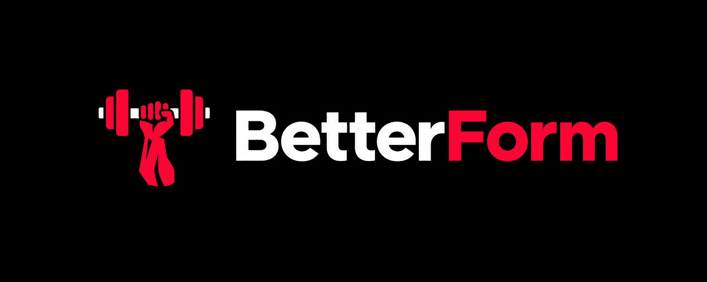

# BetterForm - Busca y aprende la técnica correcta de ejercicios de gimnasio


<p align="center">
  
</p>

---

## 📖 Acerca del proyecto

**BetterForm** es una aplicación web pensada para resolver un problema cotidiano al entrenar: querer comprobar la ejecución técnica exacta de un ejercicio de manera rapida y facil

Nació como un proyecto personal con el objetivo de ser una **herramienta útil de verdad**: una plataforma ágil que cualquiera pueda abrir en el teléfono en pleno gimnasio, escribir el ejercicio deseado y ver al instante la postura, agarre y técnica adecuada para entrenar con seguridad y prevenir lesiones.

---

## ✨ Características principales

* 🔍 **Buscador interactivo:** Permite filtrar ejercicios por nombre, grupo muscular, equipamiento o sinónimos comunes en español (ej. *pecho plano*, *jalón*, etc.). Se activa al pulsar Enter o hacer clic en las sugerencias populares.
* 🎥 **Videos técnicos de calidad:** Integración directa con videos de creadores y entrenadores referentes de la comunidad de fuerza, respetando íntegramente la autoría original.
* 📋 **Paso a paso detallado:** Cada ejercicio incluye instrucciones claras de técnica, postura, trayectoria y desglose de músculos secundarios involucrados.
* 🏷️ **Filtros por categoría y equipamiento:** Explora movimientos según el material disponible (barra, mancuernas, polea, máquina o peso corporal) y la zona del cuerpo.
* 🔄 **Recomendaciones relacionadas:** Al consultar un ejercicio, se sugieren otros movimientos de la misma categoría para complementar la rutina.
* ⚡ **Rendimiento ultraliviano:** Construido con la arquitectura de islas de Astro, entregando HTML estático optimizado con JavaScript únicamente en los componentes interactivos.
* 📱 **Diseño 100% responsive:** Interfaz oscura deportiva optimizada para teléfonos móviles, tablets y ordenadores de escritorio.

---

## 🛠️ Stack tecnológico

* **[Astro](https://astro.build)** - Framework web principal con arquitectura de islas y generación estática (SSG).
* **[React 19](https://react.dev)** - Librería para componentes con estado interactivo en el cliente (Buscador y Explorador).
* **[Tailwind CSS v4](https://tailwindcss.com)** - Motor de estilos utilitarios moderno integrado mediante `@tailwindcss/vite`.
* **[TypeScript](https://www.typescriptlang.org)** - Tipado estático de datos para garantizar robustez en el catálogo y componentes.

---

## 🚀 Cómo iniciarlo en local

### Requisitos previos

* **Node.js:** Versión `22.12.0` o superior.
* Gestor de paquetes: `npm`, `pnpm` o `yarn`.

### Instalación paso a paso

1. **Clonar el repositorio:**
   ```bash
   git clone https://github.com/lauvis11/Betterform.git
   cd Betterform
   ```

2. **Instalar dependencias:**
   ```bash
   npm install
   # o bien: pnpm install
   ```

3. **Iniciar el servidor de desarrollo:**
   ```bash
   npm run dev
   ```
   Abre [http://localhost:4321](http://localhost:4321) en tu navegador para ver la aplicación funcionando.

### Otros scripts disponibles

* `npm run build`: Compila el sitio y genera las páginas estáticas optimizadas en la carpeta `dist/`.
* `npm run preview`: Previsualiza localmente el build de producción antes de desplegar.

---

## 📄 Documentación

Puedes consultar la documentación técnica extendida y diagramas del sistema a través del siguiente enlace:

📄 **[Ver Documentación Técnica (PDF)](./docs/documentacion.pdf)**


### Estructura del proyecto


### Modelo de datos (`Exercise`)

Cada ejercicio en [`src/data/ejercicios.json`](src/data/ejercicios.json) sigue el siguiente esquema TypeScript:

```typescript
export interface Exercise {
  id: string;               // Identificador único (ej. "0001")
  name: string;             // Nombre del ejercicio (ej. "Press de banca")
  category: string;         // Grupo principal (ej. "Pecho", "Piernas", "Espalda")
  body_part: string;        // Músculo específico objetivo
  equipment: string;        // Equipamiento requerido ("barra", "mancuernas", etc.)
  instructions: string;     // Explicación técnica paso a paso
  secondary_muscles: string[]; // Músculos secundarios involucrados
  video_url: string;        // URL embebida del video explicativo
  video_type: 'video' | 'short'; // Formato del video en YouTube
  channel: {
    name: string;           // Nombre del creador/canal
    url: string;            // Enlace al canal de YouTube
  };
}
```